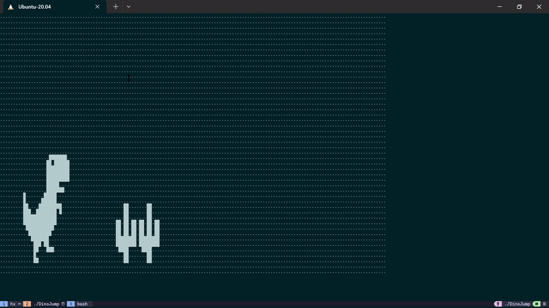

# DinoJump C++ Emulator Example
This example presents some helper code that emulates game input and output. 
The input is emulated by key presses received by stdin. 
The output is emulated by frequent printing to stdout coupled with some terminal escape sequences to move cursor and clear screen etc.

None of the code here should serve as a guideline for how to actually write the game. 
The example is mostly just to provide helper functions and demonstrate that it is possible to use the terminal to achieve the emulation we need.
Feel free to change anything in the code when actually developing the game.

# Building and running the example
The project is set up such that cmake generates the makefile. 
Technically the project is simple enough that you can probably compile with just a line of gcc command.

```
  mkdir build
  cd build
  cmake ..
  make
  ./DinoJump
```

# Demo
The program repeatedly prints out a sequence of hardcoded dinojump game frames. 

Press `space` to pause/unpause the animation. Press `q` to quit gracefully.



# Caveats
* This program probably only works on Linux/MacOS because of the terminal settings and escape seequences.
  * maybe this works on git bash, but no guarantees. 
* If the program is run and then terminated by Ctrl-C, the terminal cursor will remain hidden
  * Technially I could register a signal handler to avoid this, but that's too much work
  * The cursor is still there and typing is visible, only the cursor is not.
  * If you really miss your cursor, the `reset` command will reset the terminal and make the cursor reappear.
* The logic of the program kinda works on Arduino, but not that well, because
  * Memory constraints (on Arduino Uno, might be fine on Arduino Nano ESP32)
  * Serial is slow
* There are other constraints in the Arduino space that one should be wary of. Some parts of C++ don't work that well in Arduino. 
  * It's best to be wary of this and when in doubt google whether Arduino supports a certian C++ feature.
  * For example, C++ Strings don't work well in Arduino (presumably because the need of dynamic allocation)
    * Arduino has its own String class that is recommended by the official doc, but internet ppl (and my own experience) says that also doesn't work that well
* Could consider multithreading the input/output to make the emulator more realistic (real life is multithreaded), but that's too much work
